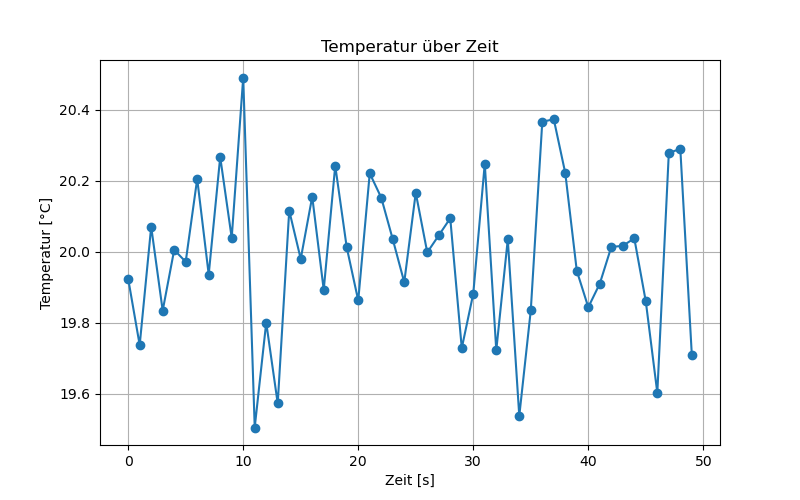
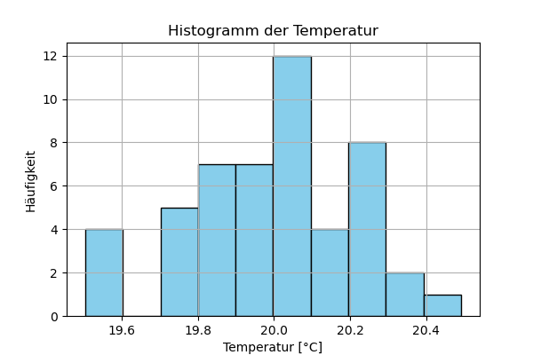

# Automatisierte Messdaten-Analyse mit Python

## Überblick
Dieses Projekt zeigt, wie Messdaten aus CSV-Dateien mit Python automatisch bereinigt, analysiert und visualisiert werden können.  
Das Skript erzeugt reproduzierbare Grafiken für Reports, die direkt in Präsentationen oder Berichte übernommen werden können.

## Features
- CSV-Daten einlesen
- Datenbereinigung und einfache Statistikberechnung (Mittelwert, Standardabweichung)
- Automatische Visualisierung mit Matplotlib
  - Liniendiagramm: Temperatur über Zeit
  - Histogramm: Verteilung der Temperatur
- Speicherung der Plots als PNG-Dateien

## Beispielplots



## Installation

1. Repository klonen:

```bash
git clone https://github.com/shadarino/data_analysis_project.git
cd data_analysis_project
